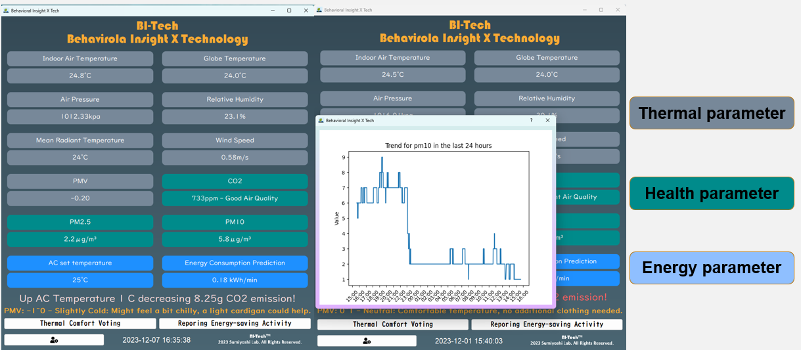
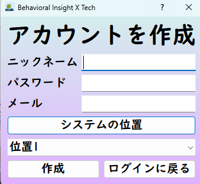
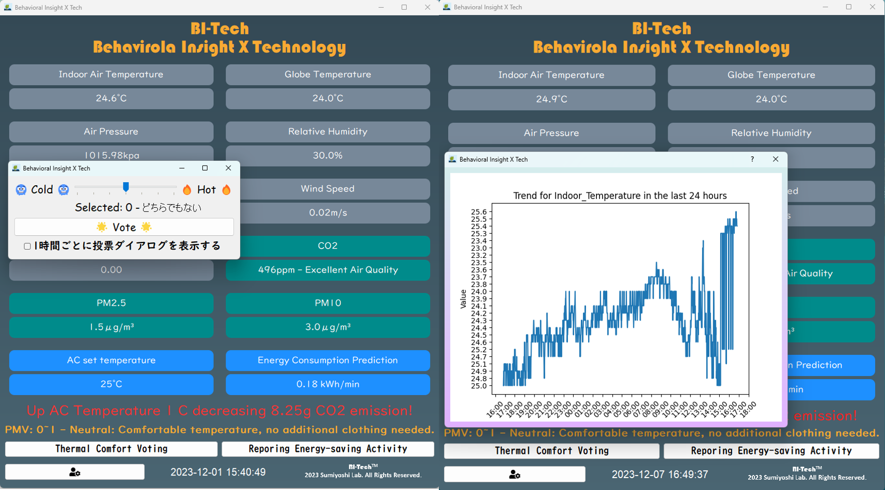
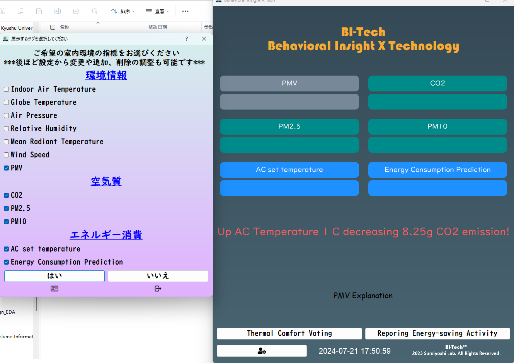

# Pyqt5-MonitorGUI

This is a desktop application based on the PyQt5 library, designed for energy management and thermal comfort monitoring in office buildings.

## Features

### Main Window

- Displays measurement data and machine learning results
- Allows users to change tags and report energy-saving information

### Login Window
 
- User account sign-in functionality
- Option to change device location near user's seat

### Thermal Comfort Voting & 24-Hour Data Review

- Users can vote on their actual thermal sensation in the office
- View past 24-hour data for various indicators through real-time API interaction with MySQL database

#### Thermal Comfort Model
The current thermal comfort model is based on Professor Fanger's PMV model from 1962. Once sufficient data is collected, the model will be adapted to suit the current office environment, providing a more accurate reflection of thermal comfort conditions and optimizing the use of air conditioning and other appliances.

### Tag Customization

- Users can choose and customize tags for data acquisition
- Interface updates dynamically based on selected tags

## Installation

To set up and run this project, follow these steps:

1. Clone the repository:git clone https://github.com/Raskiller503/Pyqt5-DesktopGUI.git
cd Pyqt5-DesktopGUI
2. Ensure you have Python 3.7 or higher installed on your system.
3. Install the required dependencies:
pip install -r requirements.txt
This will install all necessary libraries including PyQt5.
4. Set up the MySQL database:
- Install MySQL if not already installed
- Create a new database for the project
- Update the database connection settings in the configuration file (if applicable)

5. Run the application:
python main.py

## License
This project is licensed under the MIT License - see the [LICENSE](LICENSE) file for details.

